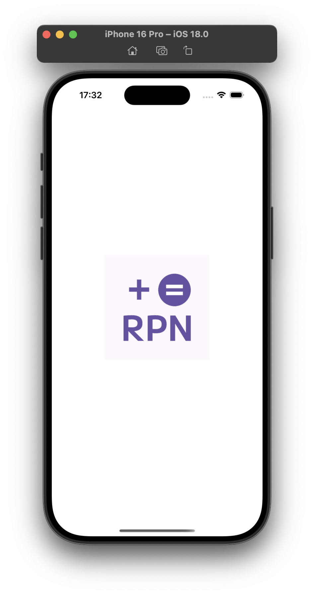
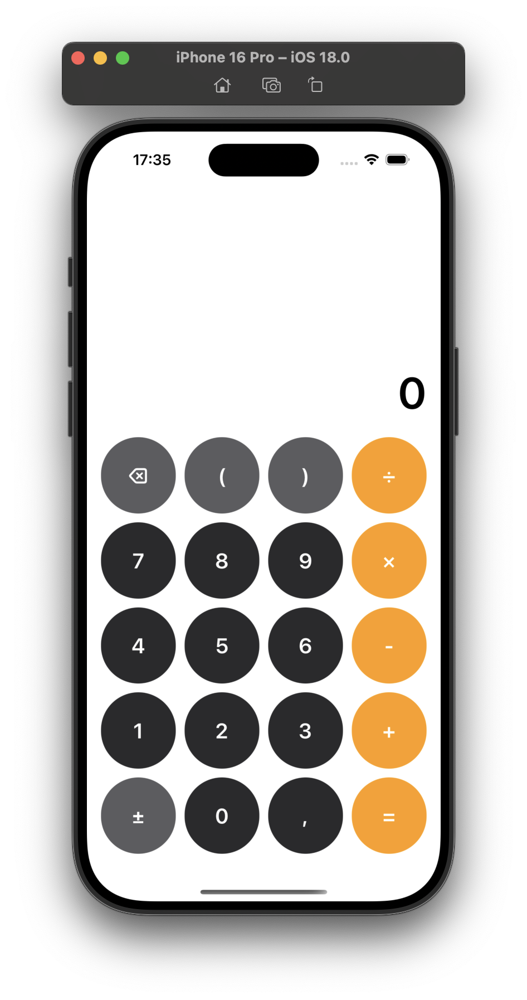
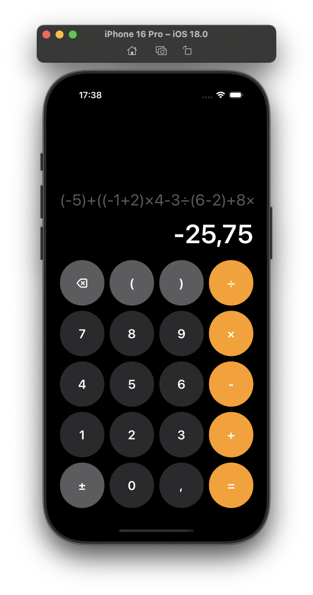
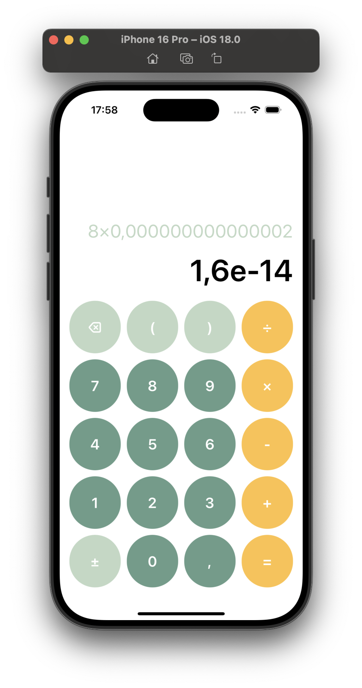
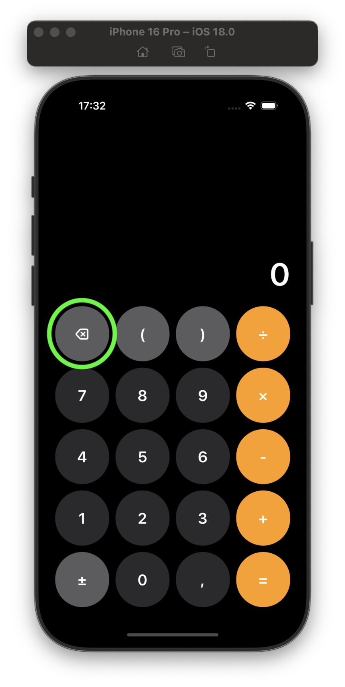
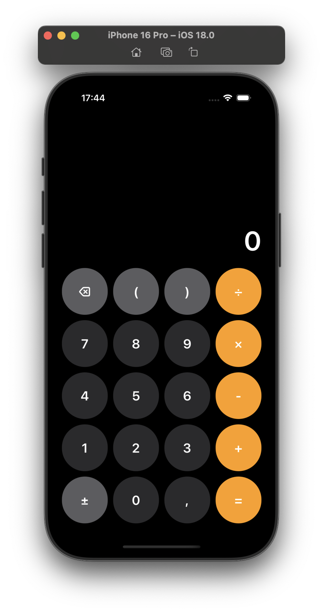
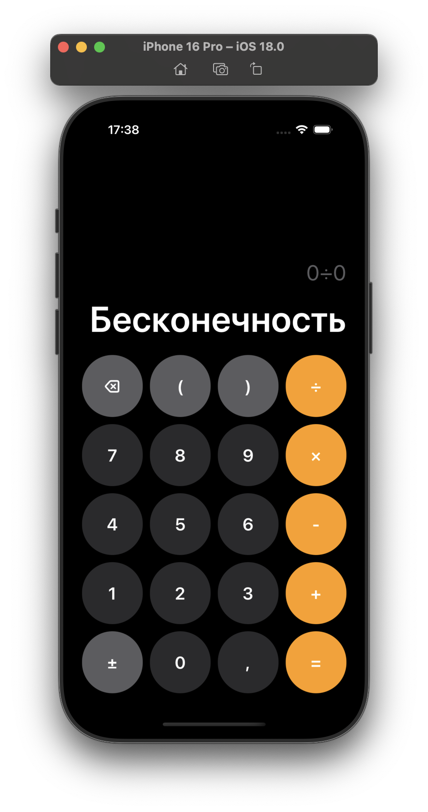

# 📱 RPN Calculator

Этот проект – калькулятор, использующий алгоритм [Shunting-yard](https://en.wikipedia.org/wiki/Shunting-yard_algorithm).  
Сначала выражение переводится в обратную польскую нотацию (RPN), после чего выполняется вычисление.  
Проект реализован с использованием архитектуры **MVVM**.

## 🎨 Скриншоты

### 🔹 Экран загрузки (Launch Screen)


### 🔹 Главный экран
**Светлая тема:**  


**Тёмная тема:**  


### ✅ Примеры вычислений  
  
  

## 🔹 Функциональность  
- **Кнопка удаления**  
  - Одно нажатие — удаляет один символ.  
  

  - Долгое нажатие — очищает всю строку.  

- **Кнопка отрицательного числа (±)**  
  - Первое нажатие делает число отрицательным.
  - Второе нажатие меняет обратно на положительное.
  


- **Поддерживаемые операции:** `+`, `-`, `×`, `÷`, `()`.

- **Обработка ошибок:**  
  - Деление на `0` отображает `Неопределено`.  
  

  - `0 ÷ 0` → `Бесконечность`.  
    

## 🚀 Установка  
1. Клонируйте репозиторий:  
   ```sh
   git clone https://github.com/username/CalculatorRPN.git
   ```

## 🛠 Технологии

- **Swift**  
- **MVVM**  
- **UIKit**  
